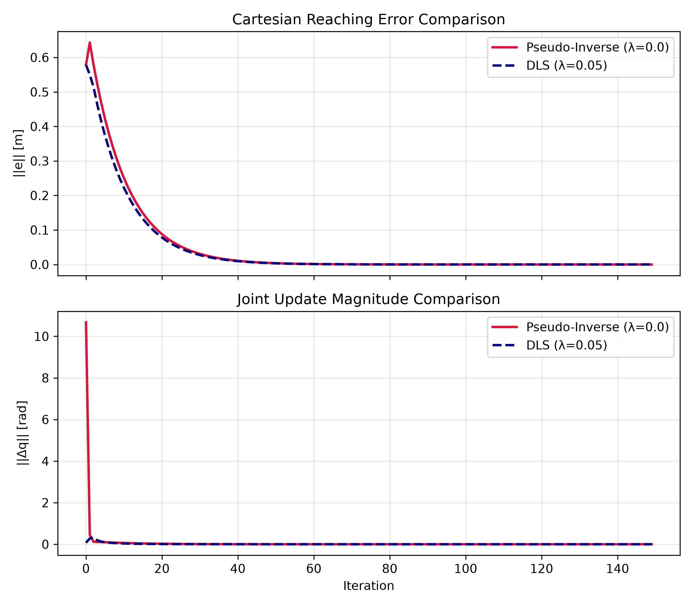

# Embodied Reach

A from-scratch robot learning project built around a planar 2-link robotic arm.

The goal is to progress from classical robotics and simulation to reinforcement learning and learned robot control, implementing the core algorithms from scratch and comparing their performance.

## Current Status

### Day 1: MuJoCo Environment + Forward Kinematics

* Built a 2-link planar robotic arm in MuJoCo.
* Configured revolute joints, motor actuators, and end-effector (`ee`) and target sites.
* Implemented Product of Exponentials (PoE) forward kinematics.
* Validated the analytical forward kinematics against MuJoCo.

### Day 2: Jacobian + Damped Least Squares Control

* Derived the analytical 2R position Jacobian and its determinant.
* Validated the analytical Jacobian against MuJoCo's `mj_jacSite`.
* Implemented a resolved-rate reaching controller using Damped Least Squares (DLS).
* Compared the pseudo-inverse and DLS controllers near a singular configuration.
* Plotted Cartesian reaching error and joint update magnitude across iterations.

**Result:** Both controllers reached the target. The pseudo-inverse produced a much larger initial joint update, while DLS limited the update through damping.

#### Key Learnings

1. The Jacobian connects joint movement to end-effector movement.
2. A singularity occurs when the robot loses the ability to move independently in one or more directions.
3. Near a singularity, the pseudo-inverse can produce very large joint updates.
4. DLS uses a damping factor to limit these large updates and make movement more stable.
5. The tradeoff is that DLS may not reach the target as precisely near singularities, but it provides more stable joint movements.

#### Experiment

The experiment compares the pseudo-inverse (\(\lambda = 0\)) against DLS (\(\lambda = 0.05\)) using the same initial configuration and target.



### Day 3: Gymnasium Reaching Environment + MDP Formulation

* Built a custom Gymnasium reaching environment around the MuJoCo 2-link arm.
* Defined a 6-dimensional physical task state consisting of joint positions, joint velocities, and target position.
* Defined a 10-dimensional observation containing joint angles represented using sine/cosine, joint velocities, target position, and end-effector-to-target displacement.
* Defined continuous 2-dimensional motor actions in the range \([-1,1]\).
* Implemented a distance-based reward with a small control penalty.
* Added random target sampling and a 200-step episode horizon.
* Validated the environment using Gymnasium's environment checker.
* Ran a 100-episode random-policy baseline.
* Implemented discounted return-to-go analysis for \(\gamma=0.9\) and \(\gamma=0.99\).

#### MDP Formulation

| Component       | Definition                                                                        |
| --------------- | --------------------------------------------------------------------------------- |
| **State**       | \(s=(q_1,q_2,\dot q_1,\dot q_2,x_t,y_t)\)                                         |
| **Observation** | `[cos q1, cos q2, sin q1, sin q2, qdot1, qdot2, target_x, target_y, dx, dy]`      |
| **Action**      | Continuous \(a_t\in[-1,1]^2\) applied to the two motors                           |
| **Transition**  | MuJoCo physics, with 5 simulation steps per environment step                      |
| **Reward**      | \(-\|x_{ee}-x_{target}\|_2 - 0.01\|a_t\|_2^2\)                                    |
| **Termination** | No task termination; reaching the target is recorded through `info["is_success"]` |
| **Truncation**  | Episode ends after 200 environment steps                                          |
| **Discount**    | \(\gamma\in\{0.9,0.99\}\)                                                         |

Under the simplified task definition, the physical state is Markov because the next state depends on the current state and action rather than the previous history.

#### Random Policy Baseline

100 episodes with randomly sampled actions:

* **Success rate:** 1.0%
* **Mean return:** -173.66 ± 79.49

The random policy provides a baseline for evaluating the learned policies developed in later experiments.

### Day 4: Policy Gradient + REINFORCE

* Derived the policy-gradient objective from the log-derivative trick.
* Derived the trajectory-level policy gradient using the fact that environment dynamics do not depend on policy parameters.
* Derived the reward-to-go formulation.
* Derived the Expected Grad-Log-Probability (EGLP) lemma and its use for action-independent baselines.
* Implemented a Gaussian policy network in PyTorch with a 10-dimensional observation input and 2-dimensional continuous action output.
* Verified the Gaussian log-probability calculation against the analytical expression with a unit test.
* Implemented REINFORCE using discounted reward-to-go.
* Trained the policy on the fixed-target reaching task across 3 random seeds.
* Logged episode return, success rate, policy loss, and gradient norm.

#### REINFORCE Experiment

The initial REINFORCE experiment showed noisy learning across seeds rather than stable convergence.

The 300-iteration runs produced transient improvements in episode return, but performance remained variable and success rates were low. This provides a baseline for the controlled variance-reduction experiment planned next.

The purpose of this experiment was primarily to establish a working policy-gradient implementation and create a baseline for subsequent improvements, rather than to tune REINFORCE to convergence.

### Day 5: REINFORCE Variance Reduction with Batch Baseline

* Added an action-independent batch baseline to the REINFORCE estimator.
* Compared REINFORCE with and without the baseline using the same training configuration.
* Evaluated both variants across 3 random seeds.
* Tracked episode return, success rate, policy loss, gradient norm, and observed gradient-norm variance.

#### Controlled Variance-Reduction Experiment

The experiment compared:

$$
A_t = G_t
$$

against the batch-baseline estimator:

$$
A_t = G_t - \frac{1}{N}\sum_i G_i
$$

The baseline is action-independent and therefore does not change the expected policy gradient.

Across all three seeds, the batch baseline produced substantially lower observed variance in the gradient norm over training iterations. However, episode returns remained noisy and success rates remained low.

**Conclusion:** The experiment supports the variance-reduction hypothesis for the measured gradient norm, but does not establish improved learning performance.

## Day 7: Generalized Advantage Estimation (GAE)

### Theoretical Foundations

Derived the mathematical relationship connecting multi-step Temporal Difference (TD) errors to full Monte Carlo advantage estimates.

Formulated the **Generalized Advantage Estimation (GAE)** operator:

$$
\hat{A}_t =
\sum_{l=0}^{\infty}
(\gamma\lambda)^l
\delta_{t+l}^{V}
$$

where the 1-step TD error is defined as:

$$
\delta_t^V =
r_t +
\gamma V(s_{t+1}) -
V(s_t)
$$

### Key Theoretical Insights

GAE provides a controllable mechanism to navigate the **bias-variance tradeoff** in reinforcement learning through the hyperparameter:

$$
\lambda \in [0,1]
$$

* **$\lambda = 0$ (High Bias, Low Variance):** Reduces strictly to the 1-step TD advantage estimator:

$$
\hat{A}_t =
\delta_t^V
$$

* **$\lambda \rightarrow 1$ (Low Bias, High Variance):** Incorporates increasingly long-horizon trajectory information, approaching the full Monte Carlo advantage estimate.

### Core Implementation Highlights (`rl/gae.py`)

**Recursive Backward Loop:** Implemented GAE using its efficient backward recursive formulation:

$$
\hat{A}_t =
\delta_t^V +
\gamma\lambda(1-d_t)
\hat{A}_{t+1}
$$

**Episode Boundary Masking:** Vectorized terminal gating using:

$$
(1-d_t)
$$

to strictly prevent reward and advantage leakage across episode terminations.

**Rollout Bootstrapping:** Handled trajectory truncation at time horizon $T$ by bootstrapping off the critic network's value estimate $V(s_T)$ (`last_value`).

**Hardware & Shape Agnostic:** Supports multi-environment vectorization with $[T,N]$ tensor shapes on CPU, CUDA GPU, or MPS.

### Verification & Testing (`tests/test_gae.py`)

Built deterministic 3-step hand-calculated test cases to verify numerical precision.

Validated:

* TD error computations
* Terminal masking behavior
* GAE recursive accumulation

All validated against `pytest`.


## Planned Work

* Implement Proximal Policy Optimization (PPO) from scratch.
* Compare the PPO policy against the classical DLS controller.
* Validate the implementation against a reference PPO implementation.
* Reproduce selected experiments from robot learning research.
* Explore imitation learning and Action Chunking with Transformers (ACT).
* Integrate learned policies with a robotics stack.

## Project Structure

```text
embodied-reach/
├── envs/
│   ├── arm2.xml
│   └── reach_env.py
├── kinematics/
├── controllers/
├── rl/
│   ├── policy.py
│   └── reinforce.py
├── derivations/
│   └── pg.md
├── tests/
│   ├── test_env.py
│   └── test_policy.py
├── notebooks/
│   └── returns.ipynb
├── results/
│   └── dls_vs_pinv.png
└── README.md
```

## Setup

The project uses Python, NumPy, Gymnasium, PyTorch, and MuJoCo and runs in a WSL2 Ubuntu environment.

More detailed setup instructions and experiment documentation will be added as the project develops.

````

**One thing I'd change from your original README in particular:** don't say simply *“Implement REINFORCE from scratch”* under Planned Work anymore. It's done. Replace it with the baseline/GAE/PPO sequence.

Then commit it as something like:

```text
docs: document Day 4 REINFORCE baseline
````

And **yes, push Day 4 even though the learning wasn't stable**. That's actually more credible than waiting until you tune it into a pretty curve.
